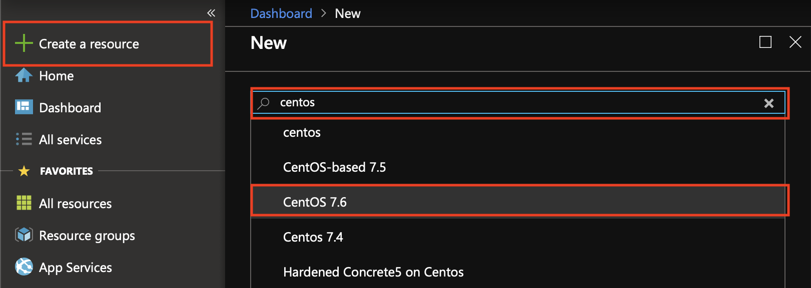
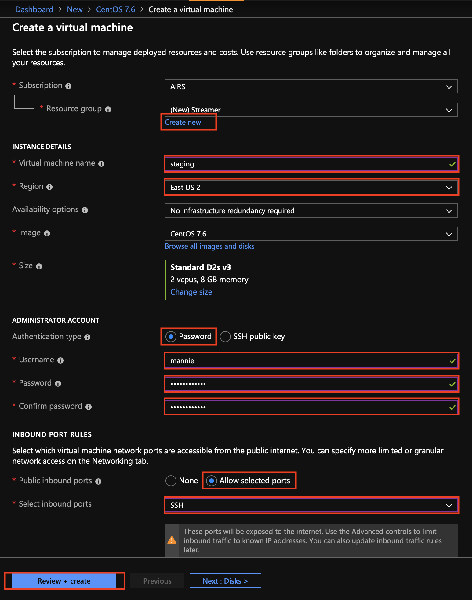
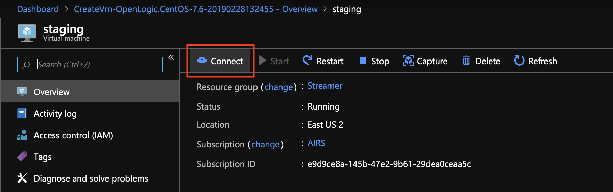
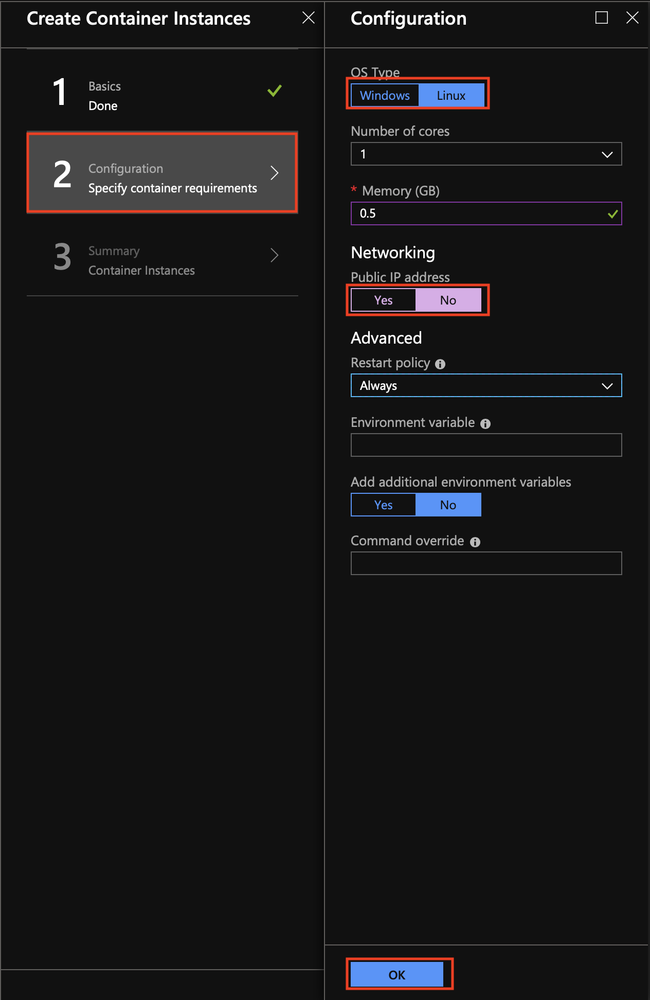

# Deploying The Streaming App Into Azure
Return to [Overview](ReadMe.md).


---


In this step, we will deploy the streamer app into Azure to run in Container Instances. In order to do so, we will need to make sure we have a an active Git client and Docker installation that we can use. The instructions below assume that you don't have either installed; if you already have these tools installed and prefer to use the local versions, feel free to do so.

We will also require access to command line interface (CLI) that is capable of [SSH tunneling](https://www.ssh.com/ssh/tunneling/). If your local CLI cannot SSH, feel free to use the [Azure Cloud Shell](https://shell.azure.com); follow these [instructions to set up your environment](CloudShell.md) if this is your first time using it.

Sections
1. [Creating the Staging VM](#creating-the-staging-vm)
1. [Configuring the VM](#configuring-the-vm)
1. [Obtaining the Streamer App](#obtaining-the-streamer-app)
1. [Deploying the Streamer App](#deploying-the-streamer-app)


---


## Creating the Staging VM
*If you already have an active Docker and Git installation, feel free to [skip this section](#obtaining-the-streamer-app).*

1. Using the [Azure Portal](https://portal.azure.com), create the Virtual Machine that will act as our working environment as we deploy the streamer app. Click on `Create a resource`. In the search box that appears, search for `centos` and select `CentOS 7.6`.
  

1. You should be presented with a panel describing the service you're going to create; click `Create`.
  

1. Complete the form with information about the VM you want to create, ensuring that you create a new resource group for your VM. Give your VM a name and select a region close to your current location (or another preferred location). Set the authentication type to `password` and provide a valid username-password pair. You will also want to make sure that SSH is selected as a public inbound port. Once you have filled the form in, click `Review + create`.
  

1. You will be asked to review the configuration of your VM; click `Create`.
  

1. Once the VM has completed deploying, click `Go to resource`.
  

1. In order to log into the VM, will need to obtain its IP address. While on the overview section of the VM, click on `Connect`.
  

1. Select `SSH` from the panel that appears, and copy the login information (for later use) which should look something like `ssh mannie@123.45.67.89`.
  


---


## Configuring the VM
*If you already have an active Docker and Git installation, feel free to [skip this section](#obtaining-the-streamer-app).*

1. SSH into your new VM via CLI using the login info provided at creation time:
    ```sh
    ssh $user@$hostip # example mannie@123.45.67.89
    ```
    You will receive a message (similar to this) asking you to confirm that you want to connect to the VM.
    ```
    The authenticity of host '40.84.44.109 (40.84.44.109)' can't be established.
    ECDSA key fingerprint is SHA256:4fYn6C2yelIAsds34GSDGTRgMrhT27Zcdfgytew45F3g.
    Are you sure you want to continue connecting (yes/no)?
    ```
    To confirm that you want to continue accessing the VM, type `yes` and hit `Enter`.

1. Once you've successfully logged in, the following commands to install Docker and its dependencies, as per the [Docker documentation](https://docs.docker.com/v17.09/engine/installation/linux/docker-ce/centos/#install-using-the-repository)). You will be prompted for your password and for confirmation; enter it and hit `Enter`.
    ```sh
    sudo yum install -y yum-utils device-mapper-persistent-data lvm2
    sudo yum-config-manager --add-repo https://download.docker.com/linux/centos/docker-ce.repo
    sudo yum install -y docker-ce
    ```
  
1. Start the Docker engine.
    ```sh
    sudo systemctl start docker
    ```
  
1. Verify that Docker installed correctly by running the `hello-world` image.
    ```sh
    sudo docker run hello-world
    ```
    You should see some output similar to the following (this confirms that Docker is correctly installed):
    ```
    Hello from Docker!
    This message shows that your installation appears to be working correctly.

    To generate this message, Docker took the following steps:
     1. The Docker client contacted the Docker daemon.
     2. The Docker daemon pulled the "hello-world" image from the Docker Hub.
        (amd64)
     3. The Docker daemon created a new container from that image which runs the
        executable that produces the output you are currently reading.
     4. The Docker daemon streamed that output to the Docker client, which sent it
        to your terminal.

    To try something more ambitious, you can run an Ubuntu container with:
     $ docker run -it ubuntu bash

    Share images, automate workflows, and more with a free Docker ID:
     https://hub.docker.com/

    For more examples and ideas, visit:
     https://docs.docker.com/get-started/
     ```

1. Install the Git SCM tool so that we can obtain a local copy of the streamer app later.
    ```sh
    sudo yum install -y git
    ```
    Use the following command to confirm the installation...
    ```sh
    which git
    ```
    ...which should yield the following result:
    ```
    /usr/bin/git
    ```  


---


## Obtaining the Streamer App

1. Git `clone` the [Event Streamer](https://github.com/mannie/EventStreamer) app.
    ```sh
    git clone https://github.com/mannie/EventStreamer.git
    ```
    You should see the output similar to the following...
    ```
    Cloning into 'EventStreamer'...
    remote: Enumerating objects: 158, done.
    remote: Counting objects: 100% (158/158), done.
    remote: Compressing objects: 100% (98/98), done.
    remote: Total 228 (delta 65), reused 130 (delta 46), pack-reused 70
    Receiving objects: 100% (228/228), 151.47 KiB | 0 bytes/s, done.
    Resolving deltas: 100% (92/92), done.
    ```
    ...and find that a new directory is available: `EventStreamer`. Change directory into the project's root, and list the contents.
    ```
    cd EventStreamer
    ls -F
    ```
    You don't need to know what to do with this folder structure yet: just note that the `Dockerfile` file exists as we will update this later.
    ```
    Dockerfile  EventStreamer.xcodeproj/  Package.swift  README.md  Sources/  Tests/
    ```
    
1. Build the app and run it locally.
    ```sh
    sudo docker build --tag streamer .
    sudo docker run --interactive --tty --rm streamer
    ```
    Once the app finishes building and starts running, the following output should be somewhat familiar:
    ```
    Linking ./.build/x86_64-unknown-linux/debug/EventStreamer
    2019-02-28 22:12:56		with...	50 		["name": "withdrawal", "current": 50, "initial": 50]
    2019-02-28 22:12:56		depo...	1000 		["name": "deposit", "current": 1000, "initial": 1000]
    2019-02-28 22:12:57		purc...	10 		["name": "purchase", "current": 10, "initial": 10]
    2019-02-28 22:12:58		purc...	10 		["name": "purchase", "current": 10, "initial": 10, "previous": 10]
    2019-02-28 22:12:59		purc...	12 		["name": "purchase", "current": 12, "initial": 10, "previous": 10]
    2019-02-28 22:13:00		with...	56 		["name": "withdrawal", "current": 56, "initial": 50, "previous": 50]
    2019-02-28 22:13:02		purc...	12 		["name": "purchase", "current": 12, "initial": 10, "previous": 12]
    2019-02-28 22:13:03		depo...	1000 		["name": "deposit", "current": 1000, "initial": 1000, "previous": 1000]
    2019-02-28 22:13:05		purc...	14 		["name": "purchase", "current": 14, "initial": 10, "previous": 12]
    ...
    ```
    To stop the streamer, hit  `Ctrl + C`.


---


## Deploying the Streamer App

1. Using the [Azure Portal](https://portal.azure.com), create a new Container Registry into which we will host our app.
  

1. Click `Create`, located at the bottom of the service summary page.
  

1. Provide a unique name for you registry. Select the project resource group and select the preferred location. Be sure to set the admin user to `Enabled`.
  

1. Once the service has successfully deployed, navigate to the `Access keys` section of the service. You will want to take note of the following properties for future use: `Registry name`, `Login server`, `Username`, and either `password` or `password2`.
  

1. In our CLI, we want to run the following commands in order to push the container image into our registry. Be sure to replace `registry=address.to.registry` with the appropriate value (e.g. `registry=streamer.azurecr.io`).
    ```sh
    registry=address.to.registry # example streamer.azurecr.io

    sudo docker login $registry # enter the Username and Password values from the previous step when/if prompted.
    sudo docker tag streamer $registry/streamer
    sudo docker push $registry/streamer
    ```
    The `docker login` command might yield similar results to...
    ```
    [sudo] password for mannie:
    Username: streamer
    Password:
    WARNING! Your password will be stored unencrypted in /root/.docker/config.json.
    Configure a credential helper to remove this warning. See
    https://docs.docker.com/engine/reference/commandline/login/#credentials-store

    Login Succeeded
    ```
    ...while the `docker push` command something like:
    ```
    The push refers to repository [streamer.azurecr.io/streamer]
    91c5a5eb2384: Pushed
    5a568a65644d: Pushed
    bad91c8e04cc: Pushing [=============>                                     ]  197.1MB/718.1MB
    b637f65d47e5: Pushing [=========>                                         ]  116.9MB/640.8MB
    68dda0c9a8cd: Pushed
    f67191ae09b8: Pushed
    b2fd8b4c3da7: Pushed
    0de2edf7bff4: Pushing [=============================>                     ]   68.8MB/117.2MB
    ```

1. In the [Azure Portal](https://portal.azure.com), we're able to examine the container we have just pushed.
  

1. Our next step involves the creation of a service that will allow our container to execute in the cloud: Container Instances. Click on `Create a resource` and find `Container Instances`.
  

1. Click on the `Create` button at the bottom of the service summary.
  

1. Give your resource a name and add it to our project resource group. Ensure that the container image type is set to `Private` and that you provide the details to your registry. Click `OK` on form completion.
  

1. Ensure that the OS Type is set to `Linux` and that public IP address is set to `No`. Click `OK` on form completion.
  

1. If everything checks out, you should be able to hit `OK` and watch your service get deployed.
  

1. Once the ACI has deployed successfully, it will automatically start executing. Head on over the to the `Containers` section of our newly deployed ACI and click on `Logs`. This output should look familiar, and should serve and confirmation of our streamer app running successfully in Azure.
  


---


Move on to [Ingesting events into Event Hubs](EventHubs.md).
