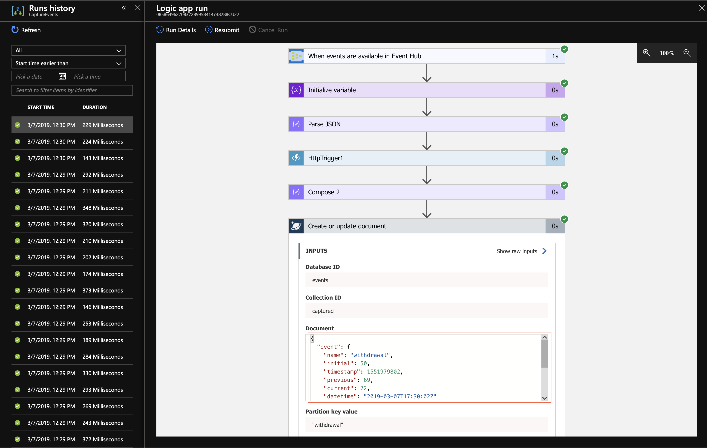

# Enriching The Event Payload
Return to [Capturing events in Cosmos DB](LogicApps.md).


---


In this section we create a simple data conversion API to convert the Unix `timestamp` into a more human friendly string. This is an overly simplified usage of the technology, much like the rest of the workshop, but hopefully enough to show you some of the possible integrations.

After converting the `timestamp`, we will update our Logic App to invoke this new API and update the document being stored in Cosmos DB to include a new `datetime` property as part of the event (i.e. `event.datetime`).

**Section Outline**
1. [Creating the Function App](#creating-the-function-app)
1. [Updating the Logic App](#updating-the-logic-app)


---


## Creating the Function App

1. Create a storage account in Azure, giving it a globally unique name. This will be used to store logs and other data, and is a pre-requisite for us to create a Functions App.
    ```sh
    # __LocalHost__
    storage=__globally_unique_name__ # example: storage=streamerclistorage
    az storage account create \
        --name $storage \
        --resource-group $group \
        --kind StorageV2 \
        --location $location \
        --sku Standard_GRS
    ```
    Output:
    ```json
    {
      "accessTier": "Hot",
      "creationTime": "2019-05-06T16:56:04.317512+00:00",
      "customDomain": null,
      "enableAzureFilesAadIntegration": null,
      "enableHttpsTrafficOnly": false,
      "encryption": { ... },
      "failoverInProgress": null,
      "geoReplicationStats": null,
      "id": "/subscriptions/xxxxxxxx-xxxx-xxxx-xxxx-xxxxxxxxxxxx/resourceGroups/StreamerCLI/providers/Microsoft.Storage/storageAccounts/streamerclistorage",
      "identity": null,
      "isHnsEnabled": null,
      "kind": "StorageV2",
      "lastGeoFailoverTime": null,
      "location": "eastus2",
      "name": "streamerclistorage",
      "networkRuleSet": { ... },
      "primaryEndpoints": { ... },
      "primaryLocation": "eastus2",
      "provisioningState": "Succeeded",
      "resourceGroup": "StreamerCLI",
      "secondaryEndpoints": null,
      "secondaryLocation": "centralus",
      "sku": { ... },
      "statusOfPrimary": "available",
      "statusOfSecondary": "available",
      "tags": {},
      "type": "Microsoft.Storage/storageAccounts"
    }
    ```

1. Add the App Insights extension before creating an App Insights resource in Azure.
    ```sh
    # __LocalHost__
    az extension add --name application-insights

    insights=__name__ # example: insights=streamercli-insights
    az monitor app-insights component create \
        --app $insights \
        --location $location \
        --resource-group $group
    ```
    Output:
    ```json
    {
      "appId": "bd97c007-1b12-4b07-b784-123e75168fdc",
      "applicationId": "streamercli-insights",
      "applicationType": "web",
      "creationDate": "2019-05-06T16:43:38.720475+00:00",
      "etag": "\"fd05d44c-0000-0200-0000-5cd0643a0000\"",
      "flowType": "Bluefield",
      "hockeyAppId": null,
      "hockeyAppToken": null,
      "id": "/subscriptions/xxxxxxxx-xxxx-xxxx-xxxx-xxxxxxxxxxxx/resourceGroups/StreamerCLI/providers/microsoft.insights/components/streamercli-insights",
      "instrumentationKey": "5d45b2ed-6c9d-4c19-9679-6e53d4a81cd4",
      "kind": "web",
      "location": "eastus2",
      "name": "streamercli-insights",
      "provisioningState": "Succeeded",
      "requestSource": "rest",
      "resourceGroup": "StreamerCLI",
      "samplingPercentage": null,
      "tags": {},
      "tenantId": "xxxxxxxx-xxxx-xxxx-xxxx-xxxxxxxxxxxx",
      "type": "microsoft.insights/components"
    }
    ```

1. Create a Functions App, giving it a globally unique name.
    ```sh
    # __LocalHost__
    functionapp=__globally_unique_name__ #example: functionapp=streamercli-utils
    az functionapp create \
        --name $functionapp \
        --resource-group $group \
        --storage-account $storage \
        --app-insights $insights \
        --consumption-plan-location $location \
        --runtime dotnet
    ```
    Output:
    ```json
    {
      "availabilityState": "Normal",
      "clientAffinityEnabled": false,
      "clientCertEnabled": false,
      "clientCertExclusionPaths": null,
      "cloningInfo": null,
      "containerSize": 1536,
      "dailyMemoryTimeQuota": 0,
      "defaultHostName": "streamercli-utils.azurewebsites.net",
      "enabled": true,
      "enabledHostNames": [ ... ],
      "geoDistributions": null,
      "hostNameSslStates": [ ... ],
      "hostNames": [ ... ],
      "hostNamesDisabled": false,
      "hostingEnvironmentProfile": null,
      "httpsOnly": false,
      "hyperV": false,
      "id": "/subscriptions/xxxxxxxx-xxxx-xxxx-xxxx-xxxxxxxxxxxx/resourceGroups/StreamerCLI/providers/Microsoft.Web/sites/streamercli-utils",
      "identity": null,
      "inProgressOperationId": null,
      "isDefaultContainer": null,
      "isXenon": false,
      "kind": "functionapp",
      "lastModifiedTimeUtc": "2019-05-06T16:57:35.943333",
      "location": "eastus2",
      "maxNumberOfWorkers": null,
      "name": "streamercli-utils",
      "outboundIpAddresses": "40.79.65.200,13.77.81.108,40.84.48.10,40.84.50.170,52.232.186.45",
      "possibleOutboundIpAddresses": "40.79.65.200,13.77.81.108,40.84.48.10,40.84.50.170,52.232.186.45,52.177.188.196,13.68.100.91",
      "redundancyMode": "None",
      "repositorySiteName": "streamercli-utils",
      "reserved": false,
      "resourceGroup": "StreamerCLI",
      "scmSiteAlsoStopped": false,
      "serverFarmId": "/subscriptions/xxxxxxxx-xxxx-xxxx-xxxx-xxxxxxxxxxxx/resourceGroups/StreamerCLI/providers/Microsoft.Web/serverfarms/EastUS2Plan",
      "siteConfig": null,
      "slotSwapStatus": null,
      "state": "Running",
      "suspendedTill": null,
      "tags": null,
      "targetSwapSlot": null,
      "trafficManagerHostNames": null,
      "type": "Microsoft.Web/sites",
      "usageState": "Normal"
    }
    ```

1. Use the core development tools to create a new Functions App project.
    ```sh
    # __RemoteHost__
    functionsDev=__name_of_directory_for_functions_development__ # example: functionsDev=StreamerUtils
    cd && func init $functionsDev --csx
    ```
    Output:
    ```
    Writing .gitignore
    Writing host.json
    Writing local.settings.json
    Writing /home/mannie/StreamerUtils/.vscode/extensions.json
    ```

1. Change directory into our newly created folder and list the contents therein.
    ```sh
    # __RemoteHost__
    cd $functionsDev && ls
    ```
    Output:
    ```
    host.json  local.settings.json
    ```

1. Create a new Function called `HttpTrigger1`, using the `HttpTrigger` template, for development using C# Script.
    ```sh
    # __RemoteHost__
    func new --name HttpTrigger1 --template HttpTrigger --csx
    ```
    Output:
    ```
    Select a template: HttpTrigger
    Function name: [HttpTrigger] Writing /home/mannie/StreamerUtils/HttpTrigger1/readme.md
    Writing /home/mannie/StreamerUtils/HttpTrigger1/run.csx
    Writing /home/mannie/StreamerUtils/HttpTrigger1/function.json
    The function "HttpTrigger1" was created successfully from the "HttpTrigger" template.
    ```

1. Update the contents of the `run.csx` file (where the code of the Function lives) for the newly created `HttpTrigger1` function with the provided code. You can confirm the change before and after the command via the `cat` command.
    ```sh
    # __RemoteHost__
    curl --silent --show-error --output HttpTrigger1/run.csx $src/Functions/Function.csx
    ```   

1. Open a new session so that we can run/debug the function locally (local is relative, in this case to the Azure VM).
    ```sh
    # __RemoteHost__
    func host start --build --csx
    ```
    Output:
    ```
    ...
    Hosting environment: Production
    Content root path: /home/mannie/StreamerUtils
    Now listening on: http://0.0.0.0:7071
    Application started. Press Ctrl+C to shut down.

    Http Functions:

    	HttpTrigger1: [GET,POST] http://localhost:7071/api/HttpTrigger1

    ...
    ```

1. Update `developmentAPI` to that it contains the localhost URI for our function, and test using `curl`.
    ```sh
    # __RemoteHost__
    developmentAPI=__url_to_localhost__ # example: developmentAPI=http://localhost:7071/api/HttpTrigger1
    echo $(curl --silent --show-error "$developmentAPI?timestamp=1557169059")
    ```
    Output:
    ```
    "2019-05-06T18:57:39Z"
    ```

1. Publish the project into our Functions App in Azure.
    ```sh
    # __RemoteHost__
    functionapp=__name_of_function_app_in_azure__ # example: functionapp=streamercli-utils
    func azure functionapp publish $functionapp
    ```
    Output:
    ```
    Getting site publishing info...
    Creating archive for current directory...
    Uploading 1.49 KB [###############################################################################]
    Upload completed successfully.
    Deployment completed successfully.
    Syncing triggers...
    Functions in streamercli-utils:
        HttpTrigger1 - [httpTrigger]
            Invoke url: https://streamercli-utils.azurewebsites.net/api/httptrigger1?code=asfOR34rweWrBS264qTmwU9JHSnAeXtBBC39H4DJa1wD9Gy3neF70Q==
    ```
    If your output doesn't yield a URL to invoke for your function, try publishing again or try the following command:
    ```
    # __RemoteHost__
    func azure functionapp list-functions $functionapp --show-keys
    ```

1. Once you have the URL for the function in Azure, update `productionAPI` and use `curl` in a similar fashion to before to confirm that everything works as expected.
    ```sh
    productionAPI=__invoke_url_shown_after_publishing__ # example: productionAPI=productionURL=https://streamercli-utils.azurewebsites.net/api/httptrigger1?code=asfOR34rweWrBS264qTmwU9JHSnAeXtBBC39H4DJa1wD9Gy3neF70Q==
    echo $(curl --silent --show-error "$productionAPI&timestamp=1557169059")
    ```
    Output:
    ```
    "2019-05-06T18:57:39Z"
    ```


---


## Updating the Logic App

1. The `CaptureEvents.3.arm.json` ARM template includes the changes necessary to accomodate the use of our newly created Function. Deploy this Logic App, pointing it to your instance of the Functions App.
    ```sh
    # __LocalHost__
    az group deployment create \
        --resource-group $group \
        --template-uri $src/Functions/CaptureEvents.3.arm.json \
        --parameters "{ \
                $(__param workflows_parent_name $logicapp), \
                $(__param workflows_parent_location $location), \
                $(__param eventhubs_hub_name $eventhub), \
                $(__param eventhubs_hub_connection_string $connexion_EH), \
                $(__param documentdb_account_name $cosmos), \
                $(__param documentdb_db_name $db), \
                $(__param documentdb_collection_name $collection), \
                $(__param documentdb_access_key $connexion_DB), \
                $(__param functions_utils_name $functionapp) \
            }"
    ```
    Output:
    ```json
    {
      "id": "/subscriptions/xxxxxxxx-xxxx-xxxx-xxxx-xxxxxxxxxxxx/resourceGroups/StreamerCLI/providers/Microsoft.Resources/deployments/CaptureEvents.3.arm",
      "location": null,
      "name": "CaptureEvents.3.arm",
      "properties": {
        "correlationId": "03fca585-10d3-4ded-9a4d-3c48667b1a35",
        "debugSetting": null,
        "dependencies": [ ... ],
        "duration": "PT2.7533427S",
        "mode": "Incremental",
        "onErrorDeployment": null,
        "outputResources": [ ... ],
        "outputs": null,
        "parameters": { ... },
        "parametersLink": null,
        "providers": [ ... ],
        "provisioningState": "Succeeded",
        "template": null,
        "templateHash": "17110812746765856905",
        "templateLink": null,
        "timestamp": "2019-05-16T21:01:09.932569+00:00"
      },
      "resourceGroup": "StreamerCLI",
      "type": null
    }
    ```
    *Remember: it's your responsibility to ensure your understand what's happening here, so take the time to do so; ask questions if you need to.*

1. Inspecting the logs for events processed after updating our Cosmos DB payload, we can see that a new `event.datetime` property exists.
  


---


Move on to [Sharing our APIs with others](APIM.md).
