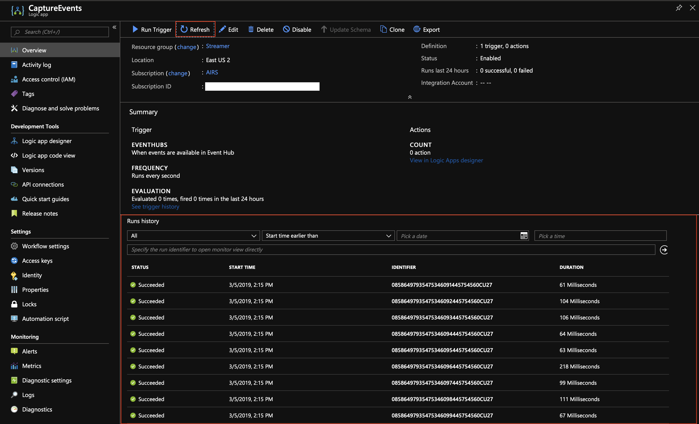
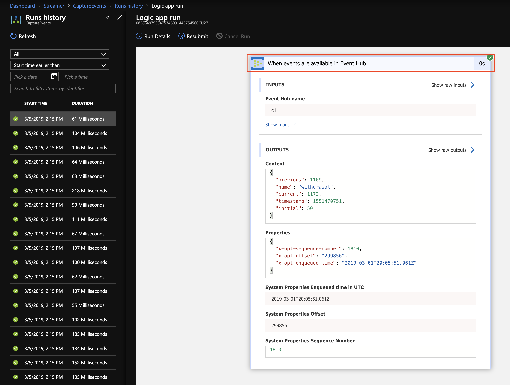
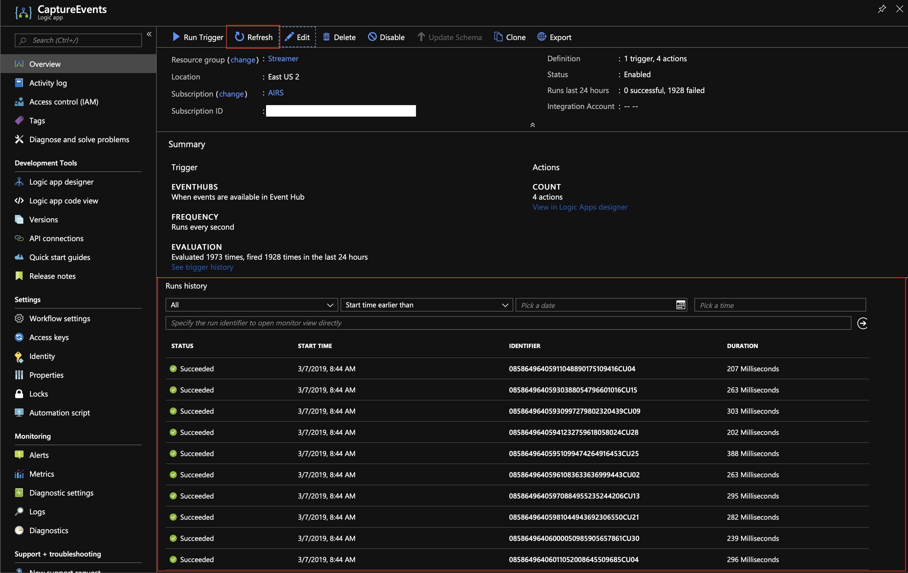
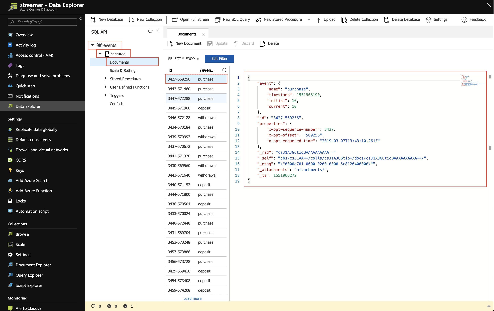

# Capturing Events In Cosmos DB
Return to [Ingesting events into Event Hubs](EventHubs.md).


---


In this section, we will create a Logic App to respond to each event being streamed through our Event Hub. We'll take the payload...
```json
{
    "name": "deposit",
    "current": 999,
    "timestamp": 1551465599,
    "previous": 1000,
    "initial": 1000
}
```
...and enrich it...
```json
{
    "event": {
        "name": "deposit",
        "current": 999,
        "timestamp": 1551465599,
        "previous": 1000,
        "initial": 1000
    },
    "id": "34634-5535768",
    "properties": {
        "x-opt-sequence-number": 34634,
        "x-opt-offset": "5535768",
        "x-opt-enqueued-time": "2019-03-01T18:39:59.942Z"
    }
}
```
...before persisting it in our Cosmos DB instance.

**Section Outline**
1. [Creating the Cosmos DB Store](#creating-the-cosmos-db-store)
1. [Creating the Logic App](#creating-the-logic-app)
1. [Enriching the Event Payload](#enriching-the-event-payload)


---


## Creating the Cosmos DB Store

1. Create a Cosmos DB account, giving it a globally unique name.
    ```sh
    # __LocalHost__
    cosmos=__globally_unique_name__ # example cosmos=streamercli
    az cosmosdb create \
        --name $cosmos \
        --resource-group $group \
        --locations $location=0 \
        --enable-multiple-write-locations true \
        --kind GlobalDocumentDB
    ```
    Output:
    ```json
    {
      "capabilities": [],
      "consistencyPolicy": {
        "defaultConsistencyLevel": "Session",
        "maxIntervalInSeconds": 5,
        "maxStalenessPrefix": 100
      },
      "databaseAccountOfferType": "Standard",
      "documentEndpoint": "https://streamercli.documents.azure.com:443/",
      "enableAutomaticFailover": false,
      "enableMultipleWriteLocations": true,
      "failoverPolicies": [ ... ],
      "id": "/subscriptions/xxxxxxxx-xxxx-xxxx-xxxx-xxxxxxxxxxxx/resourceGroups/StreamerCLI/providers/Microsoft.DocumentDB/databaseAccounts/streamercli",
      "ipRangeFilter": "",
      "isVirtualNetworkFilterEnabled": false,
      "kind": "GlobalDocumentDB",
      "location": "East US 2",
      "name": "streamercli",
      "provisioningState": "Succeeded",
      "readLocations": [ ... ],
      "resourceGroup": "StreamerCLI",
      "tags": {},
      "type": "Microsoft.DocumentDB/databaseAccounts",
      "virtualNetworkRules": [],
      "writeLocations": [ ... ]
    }
    ```

1. Create the database into which we would like to store our collections.
    ```sh
    # __LocalHost__
    db=__name__ #example db=events
    az cosmosdb database create \
        --db-name $db \
        --name $cosmos \
        --resource-group $group
    ```
    Output:
    ```json
    {
      "_colls": "colls/",
      "_etag": "\"00002100-0000-0200-0000-5cd0451b0000\"",
      "_rid": "f8k-AA==",
      "_self": "dbs/f8k-AA==/",
      "_ts": 1557153051,
      "_users": "users/",
      "id": "events"
    }
    ```

1. Create a collection into which we would like to store our documents.
    ```sh
    collection=__name__ # example collection=captured
    az cosmosdb collection create \
        --collection-name $collection \
        --db-name $db \
        --name $cosmos \
        --partition-key-path /event/name \
        --resource-group $group \
        --throughput 400
    ```
    Output:
    ```json
    {
      "collection": {
        "_conflicts": "conflicts/",
        "_docs": "docs/",
        "_etag": "\"00002300-0000-0200-0000-5cd046ba0000\"",
        "_rid": "f8k-AKWdebQ=",
        "_self": "dbs/f8k-AA==/colls/f8k-AKWdebQ=/",
        "_sprocs": "sprocs/",
        "_triggers": "triggers/",
        "_ts": 1557153466,
        "_udfs": "udfs/",
        "conflictResolutionPolicy": { ... },
        "geospatialConfig": {
          "type": "Geography"
        },
        "id": "captured",
        "indexingPolicy": { ... },
        "partitionKey": {
          "kind": "Hash",
          "paths": [
            "/event/name"
          ],
          "systemKey": false
        }
      },
      "offer": { ... }
    }
    ```


---


## Creating the Logic App

1. Logic Apps are deployed into Azure using what are known as [Azure Resource Manager (ARM) templates](https://docs.microsoft.com/en-us/azure/azure-resource-manager). Specify the source from which we would like to obtain our ARM templates and define a utility function to help us generate the parameters required by the ARM template deployment command.
    ```sh
    # __LocalHost__
    src=https://raw.githubusercontent.com/mannie/AzureStreamerWorkshop/cli/CLI
    function __param { echo "'$1' : { 'value' : '$2' }"; }
    ```

1. Give the Logic App a name and deploy an empty logic app into Azure. Feel free to view the ARM template at `$src/LogicApps/CaptureEvents.0.arm.json`, cross referencing with the output, to get some idea into what's going on under the covers.
    ```sh
    # __LocalHost__
    logicapp=__name_of_your_logic_app__ # example: logicapp=CaptureEvents

    az group deployment create \
        --resource-group $group \
        --template-uri $src/LogicApps/CaptureEvents.0.arm.json \
        --parameters "{ \
                $(__param workflows_parent_name $logicapp), \
                $(__param workflows_parent_location $location) \
            }"
    ```
    Output:
    ```json
    {
      "id": "/subscriptions/xxxxxxxx-xxxx-xxxx-xxxx-xxxxxxxxxxxx/resourceGroups/StreamerCLI/providers/Microsoft.Resources/deployments/CaptureEvents.0.arm",
      "location": null,
      "name": "CaptureEvents.0.arm",
      "properties": {
        "correlationId": "0cc607ed-e201-4108-9874-c7119787a610",
        "debugSetting": null,
        "dependencies": [],
        "duration": "PT1.6909185S",
        "mode": "Incremental",
        "onErrorDeployment": null,
        "outputResources": [
          {
            "id": "/subscriptions/xxxxxxxx-xxxx-xxxx-xxxx-xxxxxxxxxxxx/resourceGroups/StreamerCLI/providers/Microsoft.Logic/workflows/CaptureEvents",
            "resourceGroup": "StreamerCLI"
          }
        ],
        "outputs": null,
        "parameters": {
          "workflows_parent_location": {
            "type": "String",
            "value": "eastus2"
          },
          "workflows_parent_name": {
            "type": "String",
            "value": "CaptureEvents"
          }
        },
        "parametersLink": null,
        "providers": [
          {
            "id": null,
            "namespace": "Microsoft.Logic",
            "registrationState": null,
            "resourceTypes": [
              {
                "aliases": null,
                "apiVersions": null,
                "locations": [
                  "eastus2"
                ],
                "properties": null,
                "resourceType": "workflows"
              }
            ]
          }
        ],
        "provisioningState": "Succeeded",
        "template": null,
        "templateHash": "11195913884786892628",
        "templateLink": null,
        "timestamp": "2019-05-16T20:33:52.313716+00:00"
      },
      "resourceGroup": "StreamerCLI",
      "type": null
    }
    ```

1. Next we will deploy a version of the Logic App that listens to the specified Event Hub for events.
    ```sh
    # __LocalHost__
    printf -v __getEventHubsSharedPolicy '%q ' \
        az eventhubs namespace authorization-rule list \
            --namespace-name $namespace \
            --resource-group $group \
            --query "[?contains(rights, 'Send')].name" \
            --output tsv

    printf -v __getEventHubsConnectionString '%q ' \
        az eventhubs namespace authorization-rule keys list \
            --name `eval $__getEventHubsSharedPolicy` \
            --namespace-name $namespace \
            --resource-group $group \
            --query primaryConnectionString \
            --output tsv

    az group deployment create \
        --resource-group $group \
        --template-uri $src/LogicApps/CaptureEvents.1.arm.json \
        --parameters "{ \
                $(__param workflows_parent_name $logicapp), \
                $(__param workflows_parent_location $location), \
                $(__param eventhubs_hub_name $eventhub), \
                $(__param eventhubs_hub_connection_string `eval $__getEventHubsConnectionString`) \
            }"
    ```
    Output:
    ```json
    {
      "id": "/subscriptions/xxxxxxxx-xxxx-xxxx-xxxx-xxxxxxxxxxxx/resourceGroups/StreamerCLI/providers/Microsoft.Resources/deployments/CaptureEvents.1.arm",
      "location": null,
      "name": "CaptureEvents.1.arm",
      "properties": {
        "correlationId": "b10858cc-d978-4ae9-bee2-a6b9b9174386",
        "debugSetting": null,
        "dependencies": [
          {
            "dependsOn": [
              {
                "id": "/subscriptions/xxxxxxxx-xxxx-xxxx-xxxx-xxxxxxxxxxxx/resourceGroups/StreamerCLI/providers/Microsoft.Web/connections/eventhubs",
                "resourceGroup": "StreamerCLI",
                "resourceName": "eventhubs",
                "resourceType": "Microsoft.Web/connections"
              }
            ],
            "id": "/subscriptions/xxxxxxxx-xxxx-xxxx-xxxx-xxxxxxxxxxxx/resourceGroups/StreamerCLI/providers/Microsoft.Logic/workflows/CaptureEvents",
            "resourceGroup": "StreamerCLI",
            "resourceName": "CaptureEvents",
            "resourceType": "Microsoft.Logic/workflows"
          }
        ],
        "duration": "PT6.2839354S",
        "mode": "Incremental",
        "onErrorDeployment": null,
        "outputResources": [
          {
            "id": "/subscriptions/xxxxxxxx-xxxx-xxxx-xxxx-xxxxxxxxxxxx/resourceGroups/StreamerCLI/providers/Microsoft.Logic/workflows/CaptureEvents",
            "resourceGroup": "StreamerCLI"
          },
          {
            "id": "/subscriptions/xxxxxxxx-xxxx-xxxx-xxxx-xxxxxxxxxxxx/resourceGroups/StreamerCLI/providers/Microsoft.Web/connections/eventhubs",
            "resourceGroup": "StreamerCLI"
          }
        ],
        "outputs": null,
        "parameters": { ... },
        "parametersLink": null,
        "providers": [ ... ],
        "provisioningState": "Succeeded",
        "template": null,
        "templateHash": "8974504646592131398",
        "templateLink": null,
        "timestamp": "2019-05-16T20:41:27.604850+00:00"
      },
      "resourceGroup": "StreamerCLI",
      "type": null
    }
    ```

    *By this stage, you're expected to already cross-referencing the ARM templates with the output, or asking the proctor(s) for additional information on what this command is doing.*
1. The `Overview` section of the Logic App should indicate that the Logic App has received and processed events (see the `Runs history` panel). If the `Runs history` isn't showing any activity, click the `Refresh` button located above the `Runs history` section.
  

1. Clicking on an execution in the `Runs history` allows you to view more information about that run. All the actions in the Logic App will appear in a collapsed state with an icon indicating their success/failure; to expand an action to view more information, simply click on it. You should find that the `Content` of the Logic App trigger looks very similar to:
    ```json
    {
        "name": "deposit",
        "current": 999,
        "timestamp": 1551465599,
        "previous": 1000,
        "initial": 1000
    }
    ```
    


---


## Enriching the Event Payload

1. We will now deploy a version of the Logic App that will enrich the payload from the Event Hub and store it in our Cosmos DB collection.
    ```sh
    # __LocalHost__
    printf -v __getCosmosDBAccessKey '%q ' \
        az cosmosdb list-keys \
            --name $cosmos \
            --resource-group $group \
            --query primaryMasterKey \
            --output tsv

    az group deployment create \
        --resource-group $group \
        --template-uri $src/LogicApps/CaptureEvents.2.arm.json \
        --parameters "{ \
                $(__param workflows_parent_name $logicapp), \
                $(__param workflows_parent_location $location), \
                $(__param eventhubs_hub_name $eventhub), \
                $(__param eventhubs_hub_connection_string `eval $__getEventHubsConnectionString`), \
                $(__param documentdb_account_name $cosmos), \
                $(__param documentdb_db_name $db), \
                $(__param documentdb_collection_name $collection), \
                $(__param documentdb_access_key `eval $__getCosmosDBAccessKey`) \
            }"
    ```
    Output:
    ```json
    {
      "id": "/subscriptions/xxxxxxxx-xxxx-xxxx-xxxx-xxxxxxxxxxxx/resourceGroups/StreamerCLI/providers/Microsoft.Resources/deployments/CaptureEvents.2.arm",
      "location": null,
      "name": "CaptureEvents.2.arm",
      "properties": {
        "correlationId": "754065ee-cd8e-4d7c-9c56-e96a23c7ce24",
        "debugSetting": null,
        "dependencies": [ ... ],
        "duration": "PT6.0503344S",
        "mode": "Incremental",
        "onErrorDeployment": null,
        "outputResources": [
          {
            "id": "/subscriptions/xxxxxxxx-xxxx-xxxx-xxxx-xxxxxxxxxxxx/resourceGroups/StreamerCLI/providers/Microsoft.Logic/workflows/CaptureEvents",
            "resourceGroup": "StreamerCLI"
          },
          {
            "id": "/subscriptions/xxxxxxxx-xxxx-xxxx-xxxx-xxxxxxxxxxxx/resourceGroups/StreamerCLI/providers/Microsoft.Web/connections/documentdb",
            "resourceGroup": "StreamerCLI"
          },
          {
            "id": "/subscriptions/xxxxxxxx-xxxx-xxxx-xxxx-xxxxxxxxxxxx/resourceGroups/StreamerCLI/providers/Microsoft.Web/connections/eventhubs",
            "resourceGroup": "StreamerCLI"
          }
        ],
        "outputs": null,
        "parameters": { ... },
        "parametersLink": null,
        "providers": [ ... ],
        "provisioningState": "Succeeded",
        "template": null,
        "templateHash": "8927459570445292905",
        "templateLink": null,
        "timestamp": "2019-05-16T20:42:32.664822+00:00"
      },
      "resourceGroup": "StreamerCLI",
      "type": null
    }
    ```

1. Feel free to inspect the recent execution via the `Runs history` section of the `Overview` blade. Remember, if the `Runs history` isn't showing any activity, click the `Refresh` button located above the `Runs history` section.
  

1. To inspect the save documents in Cosmos DB, head on over to the `Data Explorer` on your Cosmos DB resource. Select the database, the collection, then the `Documents` option. You will find a list of the persisted documents; click to view any of the documents to inspect. The document should look like this (with a few additional properties prefixed by an underscore):
    ```json
    {
        "event": {
            "name": "deposit",
            "current": 999,
            "timestamp": 1551465599,
            "previous": 1000,
            "initial": 1000
        },
        "id": "34634-5535768",
        "properties": {
            "x-opt-sequence-number": 34634,
            "x-opt-offset": "5535768",
            "x-opt-enqueued-time": "2019-03-01T18:39:59.942Z"
        }
    }
    ```
    


---


Move on to [Enriching the event's payload](Functions.md).
