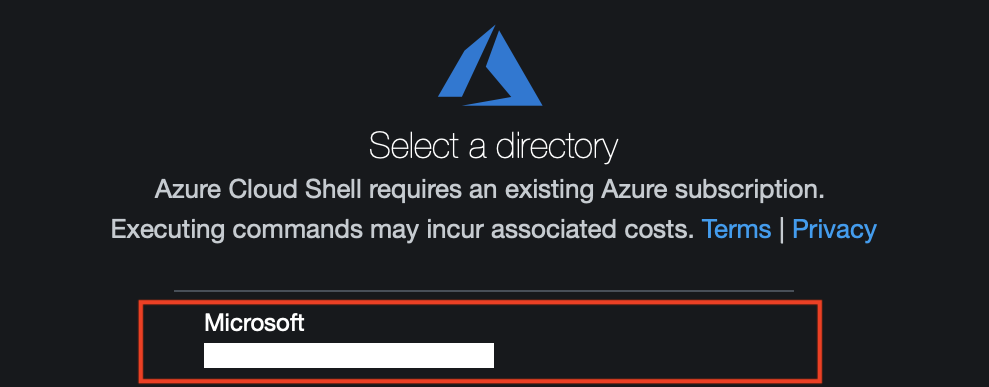
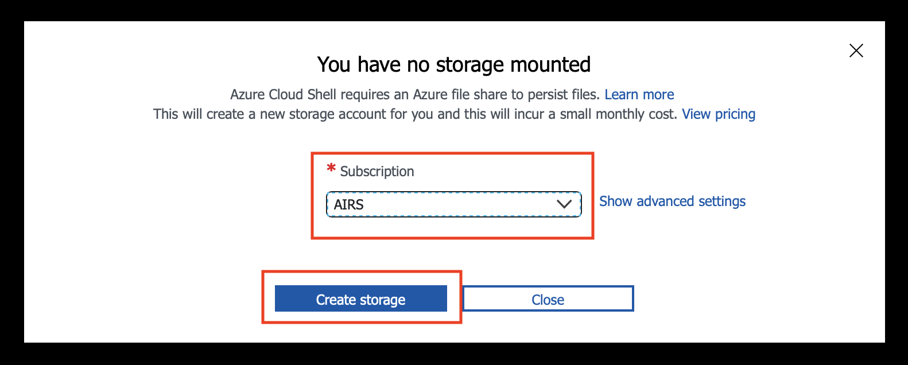
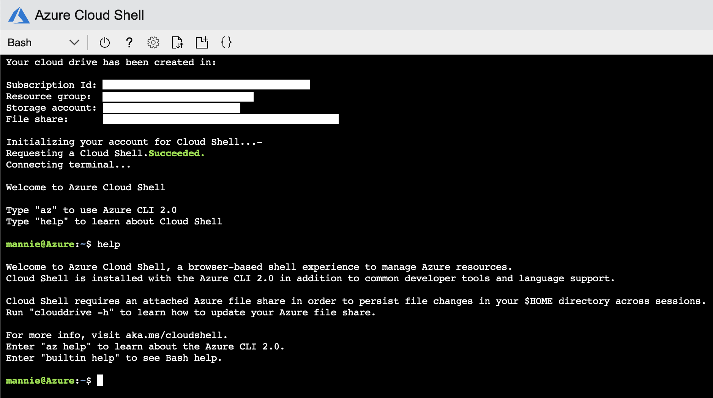

# Using Cloud Shell For The First Time
Return to [Deploying the streaming app into Azure](ACI.md).

---

In this section, we will walk through how to get started using the Azure Cloud Shell. If you have a local SSH capable CLI, it may be preferable to use that; if not, follow the following steps:

1. Open a new tab in your web browser and navigate to https://shell.azure.com.
1. When prompted to select a directory, select the directory in which you will create the resources required for the remainder of the workshop.
  
1. If prompted to create a storage, select the subscription which you intend to use for the workshop from the dropdown list, and click *Create storage*.
  
1. You should now be presented an interactive CLI similar to the one shown below.
  

---

Move on to [Ingesting events into Event Hubs](EventHubs.md).
