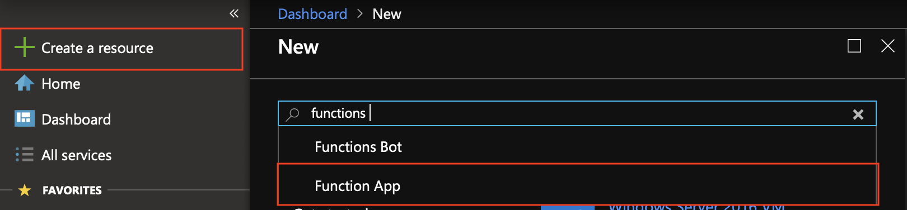
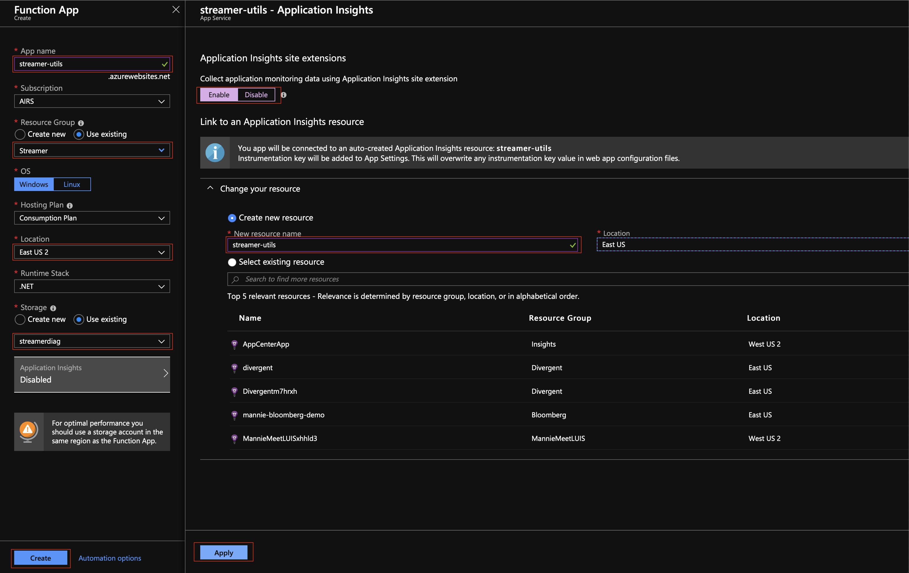
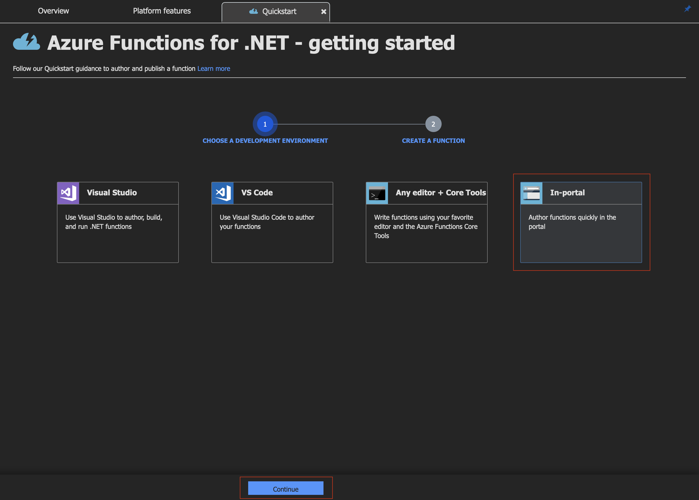
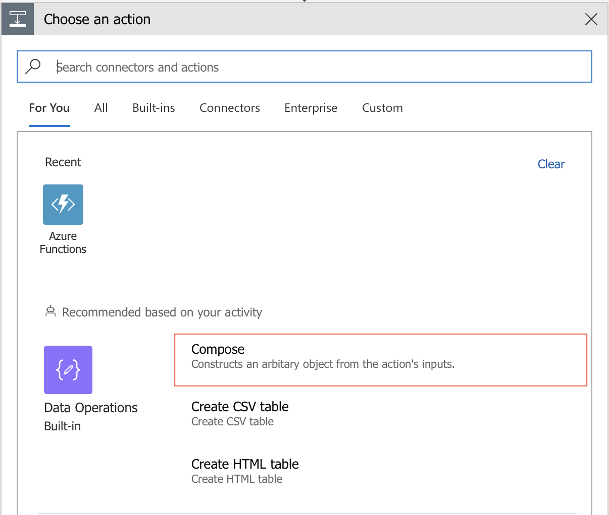
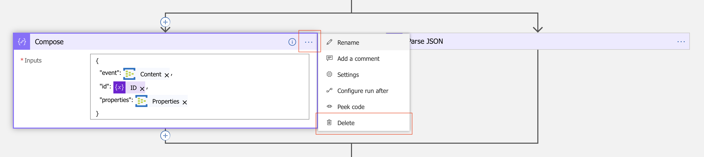
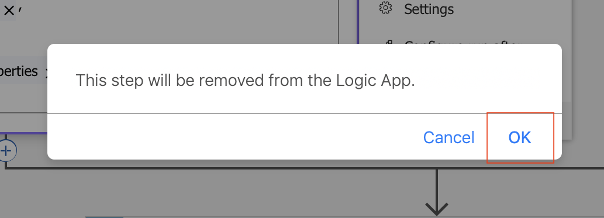

# Enriching The Event Payload
Return to [Capturing events in Cosmos DB](LogicApps.md).


---


In this section we create a simple data conversion API to convert the Unix `timestamp` into a more human friendly string. This is an overly simplified usage of the technology, much like the rest of the workshop, but hopefully enough to show you some of the possible integrations.

After converting the `timestamp`, we will update our Logic App to invoke this new API and update the document being stored in Cosmos DB to include a new `datetime` property as part of the event (i.e. `event.datetime`).

**Section Outline**
1. [Creating the Function App](#creating-the-function-app)
1. [Updating the Logic App](#updating-the-logic-app)


---


## Creating the Function App

1. Click on `Create a resource` and find the `Function App` resource.
  

1. After the service summary, click `Create`.
  

1. Fill in the form giving the app a globally unique name. Select the resource group for the workshop, a preferred location, and reuse the storage account that we already have in our resource group. If you want to collect logs (which is very useful), be sure to enable Application Insights: give your Insights resource a name, location, and click `Apply`. If validation is successful, hit `Create`.
  

1. On successful deployment, open your Function App and click on `+ New function`.
  

1. We have different ways to develop and deploy our API. For production workloads, we would typically select the options for local development, which allow us to version our code and build out a CI/CD pipeline. For the purposes of this workshop, we will be doing everything `In-portal`; make the appropriate selection and click `Continue`.
  

1. Select `Webhook + API` and click `Create`. This will allow us to create a REST API that we can `GET` or `POST` to.
  

1. Paste the following code into the editor and hit `Save`. Open the `Test` panel so that we can validate our API's behaviour after.
    ```csx
    #r "Newtonsoft.Json"

    using System.Net;
    using Microsoft.AspNetCore.Mvc;
    using Microsoft.Extensions.Primitives;
    using Newtonsoft.Json;

    public static async Task<IActionResult> Run(HttpRequest req, ILogger log)
    {
        log.LogInformation("C# HTTP trigger function processed a request.");

        // Obtain the "timestamp" query param from the URL: "http://...?timestamp=1552053470"
        string value = req.Query["timestamp"];

        // If we don't have a "timestamp" query param, try and read the request's body to find one
        // { "timestamp" : 1552053470, ... }
        string requestBody = await new StreamReader(req.Body).ReadToEndAsync();
        dynamic data = JsonConvert.DeserializeObject(requestBody);
        value = value ?? data?.timestamp;

        // Convert the "timestamp" from a string to an int
        var timestamp = Convert.ToInt64(value);

        // Convert the offset to a DateTime object.
        DateTimeOffset dateTimeOffset = DateTimeOffset.FromUnixTimeSeconds(timestamp);
        DateTime dateTime = dateTimeOffset.UtcDateTime;

        // Return the human readable dateTime in the response body.
        return dateTime != null
            ? (ActionResult)new OkObjectResult(dateTime)
            : new BadRequestObjectResult(null);
    }
    ```
  

1. Set the HTTP method to `POST` and the request body to `{ "timestamp" : 1552053470 }`. The code also supports `GET`; feel free to experiement a little with the available options. Click `Run` to execute the function with the provided params; you should see the string dateTime along with some additional logs.
  


---


## Updating the Logic App

1. Let's return to our Logic App; open it for editing.
  

1. `Add an action` just before the Cosmos DB action.
  

1. Find the `Azure Functions` grouping.
  

1. Select the Function app that we created in the previous step.
  

1. Select the function we created. You'll notice that it has a weird name (`HttpTrigger1`); this is due to how we created the function. We took a shortcut, effectively skipping the step where we would provide a custom name to our API. *This is somewhat representative of what we see in the real world; APIs don't always have the signature we want them to have and changing these signatures is sometimes expensive (or even impossible). Later in the workshop, we will provide a better name to our API via the API Management service.*
  

1. Update the function's request body to `{ "timestamp" : $timestamp }`, where `$timestamp` is a value extracted by the preceding `Parse JSON` action.
  

1. Set the HTTP method of the function call to `POST`. Click on `Add new parameter`, select `Method`, and then `POST`.
  

1. Now we will need to update the payload being stored in Cosmos DB to include a new `event.datetime` value. `Add an action` immediately after the function call.
  

1. Find the `Compose` action.
  

1. Copy the body of the preceding `Compose` action into this new action, excluding the value for `event`. Click on where the value of `event` should be, then click on `Expression` from the dynamic content popover.
   

1. We will add a new property `datetime` to the Event Hub trigger's `Content` value. Type `addProperty()` into the formula text field. The `addProperty()` *expression function* expects 3 parameters (in order): the `collection` to add the property to, the `name` of the property, and the `value` of the property.
  

1. Click over to the `Dynamic content` tab of the popover; ensure that your keyboard curser is between the `addProperty()` parentheses (i.e. where `_` is in `addProperty(_)`). Select the Event Hub's `Content` as the first parameter (the collection) of our invocation to `addProperty()`.
  

1. Add the second parameter (the name of the property) to our `addProperty()` invocation. Add the following text just before the closing parentheses: `, 'datetime', `. Our expression should look like:
    ```
    addProperty(triggerBody()?['ContentData'], 'datetime', )
    ```
  

1. Ensuring our keyboard's cursor is between the last comma and closing parentheses, click on the `Body` value resulting from the function call. Before clicking `OK`, ensure that your expression reads:
    ```
    addProperty(triggerBody()?['ContentData'], 'datetime', body('HttpTrigger1'))
    ```
  

1. Remove the current document value being persisted to Cosmos DB by expanding the collapsed action and clicking on the `x` associated with the document value.
  

1. Since the output of the old `Compose` action is no longer in use, we can now remove it and make our Logic App a little cleaner. Find the old `Compose` action. Click on the action's `...` and select the `Delete` option.
  

1. Confirm the deletion when prompted: `OK`.
  

1. Set the output of our new `Compose` action as the new document to persist into Cosmos DB.
  

1. `Save` your Logic App before navigating out of the editor.
  

1. Inspecting the logs for events processed after updating our Cosmos DB payload, we can see that a new `event.datetime` property exists.
  


---


Move on to [Sharing our APIs with others](APIM.md).
