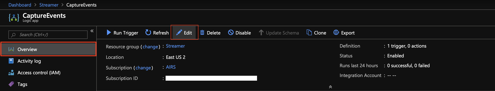
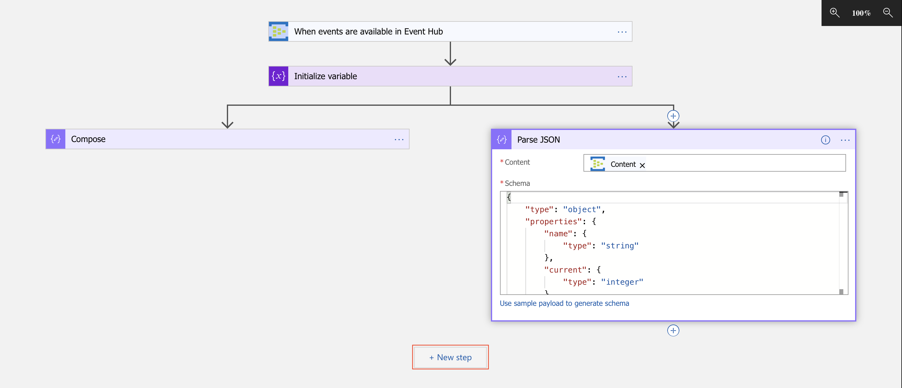

# Capturing Events In Cosmos DB
Return to [Ingesting events into Event Hubs](EventHubs.md).


---


In this section, we will create a Logic App to respond to each event being streamed through our Event Hub. We'll take the payload...
```json
{
    "name": "deposit",
    "current": 999,
    "timestamp": 1551465599,
    "previous": 1000,
    "initial": 1000
}
```
...and enrich it...
```json
{
    "event": {
        "name": "deposit",
        "current": 999,
        "timestamp": 1551465599,
        "previous": 1000,
        "initial": 1000
    },
    "id": "34634-5535768",
    "properties": {
        "x-opt-sequence-number": 34634,
        "x-opt-offset": "5535768",
        "x-opt-enqueued-time": "2019-03-01T18:39:59.942Z"
    }
}
```
...before persisting it in our Cosmos DB instance.

**Section Outline**
1. [Creating the Cosmos DB Store](#creating-the-cosmos-db-store)
1. [Creating the Logic App](#creating-the-logic-app)
1. [Enriching the Event Payload](#enriching-the-event-payload)


---


## Creating the Cosmos DB Store

1. Click on `Create a resource` and find `Azure Cosmos DB`.
  

1. Click `Create` at the bottom of the service summary.
  

1. Fill in the service creation form, selecting the workshop's resource group and a location of your choosing. Give the service a globally unique name, and select `Core (SQL)` as the API. Click on `Review + create`.
  

1. Upon successful validation, click `Create`, otherwise resolve the validation errors.
  

1. Once your Cosmos DB has finished deploying, head on over to the `Data Explorer` section. Click on `New Collection` from the blade on the right. A panel will appear on the far right. Give the database and the collection to be created a name, and set the collection's partition key to `/event/name`. Click `OK` once done.
  


---


## Creating the Logic App

1. Click `Create a resource` and find `Logic App`.
  

1. Click `Create` which appears at the bottom of the service summary.
  

1. Give the Logic App a name, add it to the workshop's resource group, and select your preferred location. Click `Create` once done. Once the Logic App has deployed successfully, go to the resource.
  

1. *If opening your Logic App didn't show you an introduction to Logic Apps, click on the `Edit` button from the `Overview` section of the Logic App.*
  

1. Select the `Blank Logic App` template.
  

1. Filter the triggers to only show those from `Event Hubs`. Select the `When events are available in Event Hub` trigger; this will allow the Logic App to execute each time an event is streamed through our Event Hub.
  

1. Give the connection a name of your choosing, and select the namespace associated to the Event Hub we created earlier.
  

1. Select the available access policy from the list presented to you, and click `Create`
  

1. Select the Event Hub we created earlier, and set the trigger to deserialize the data as `application/json`. Specify an interval at which to poll the Event Hub for new events, and hit `Save`.
  

1. The `Overview` section of the Logic App should indicate that the Logic App has received and processed events (see the `Runs history` panel). If the `Runs history` isn't showing any activity, click the `Refresh` button located above the `Runs history` section.
  

1. Clicking on an execution in the `Runs history` allows you to view more information about that run. All the actions in the Logic App will appear in a collapsed state with an icon indicating their success/failure; to expand an action to view more information, simply click on it. You should find that the `Content` of the Logic App trigger looks very similar to:
    ```json
    {
        "name": "deposit",
        "current": 999,
        "timestamp": 1551465599,
        "previous": 1000,
        "initial": 1000
    }
    ```
  


---


## Enriching the Event Payload

1. Let's return to the Logic App editor by clicking `Edit` from the `Overview` section of the service.
  

1. Click `+ New step` to add another action to our Logic App.
  

1. We are going to create a variable which will hold the value for our object's ID before persisting it into Cosmos DB. Find the `Variables` grouping and select `Initialize variable`.
  

1. Set the name of our variable to `ID`, type to `String`, and the value to `SequenceNumber-Offset`. The sequence number and offset can be obtained via the popup that appears after clicking on the value text field; if it doesn't automatically appear, click `Add dynamic content`. Click `+ New step` after.
  

1. Find the `Compose` action; we will use this to craft the JSON document that we want to persist.
  

1. Update the input of the composer with JSON similar to...
    ```json
    {
        "event" : $content,
        "id" : $id,
        "properties" : $properties
    }
    ```
    ...where `$content`, `$id`, and `$properties` are replaced by the `Content` from the Event Hub trigger, the `ID` variable, and the `Properties` from the Event Hub trigger, respectively.
  

1. Next, we're going to extract individual values from the `Content` from the Logic App's Event Hub trigger. This doesn't need to be performed sequential and can therefor be parallelized. Click on the `+` preceding our composed, then `Add a parallel branch`.
  

1. Find and select the `Parse JSON` action.
  

1. Set the Event Hub's `Content` as the value of the `Parse JSON` action's content. Will we use a sample/template of the payload to generate the JSON schema required by this action to extract the individual components; click on `Use sample payload to generate schema`.
  

1. Paste in the following template (or similar) and click `Done`.
    ```json
    {
        "name": "deposit",
        "current": 999,
        "timestamp": 1551465599,
        "previous": 1000,
        "initial": 1000
    }
    ```
  

1. Now we can persist our document into Cosmos DB. Click `+ New step`.
  

1. Find the Cosmos DB group, and select the `Create or update document` action.
  

1. Provide a name for the connection to Cosmos DB, select the Cosmos DB instance, and hit `Create`.
  

1. Select the database and collection where the document will be stored. Set the output of our `Compose` action from earlier as the document to persist.
  

1. Before we can successfully store our document, we need to let Cosmos DB know the value to use for partitioning. Click on `Add new parameter` and check the `Partition key value` item.
  

1. Set the `Partition key value` to the `name` extracted via our `Parse JSON` action earlier. Be sure to enclose this value in double quotes: `"$name"`. Once done, feel free to `Save` your Logic App so that the changes we've made can take effect.
  

1. Feel free to inspect the recent execution via the `Runs history` section of the `Overview` blade. Remember, if the `Runs history` isn't showing any activity, click the `Refresh` button located above the `Runs history` section.
  

1. To inspect the save documents in Cosmos DB, head on over to the `Data Explorer` on your Cosmos DB resource. Select the database, the collection, then the `Documents` option. You will find a list of the persisted documents; click to view any of the documents to inspect. The document should look like this (with a few additional properties prefixed by an underscore):
    ```json
    {
        "event": {
            "name": "deposit",
            "current": 999,
            "timestamp": 1551465599,
            "previous": 1000,
            "initial": 1000
        },
        "id": "34634-5535768",
        "properties": {
            "x-opt-sequence-number": 34634,
            "x-opt-offset": "5535768",
            "x-opt-enqueued-time": "2019-03-01T18:39:59.942Z"
        }
    }
    ```
  


---


Move on to [Enriching the event's payload](Functions.md).
