# Deploying The Streaming App Into Azure
Return to [Getting Started with Azure Portal](ReadMe.md).


---


In this section, we will deploy the streamer app into Azure to run in Container Instances. In order to do so, we will need to make sure we have an active Git client and Docker installation that we can use. The instructions below assume that you don't have either installed; if you already have these tools installed and prefer to use the local versions, feel free to do so.

**Section Outline**
1. [Creating the Staging VM](#creating-the-staging-vm)
1. [Configuring the VM](#configuring-the-vm)
1. [Obtaining the Streamer App](#obtaining-the-streamer-app)
1. [Deploying the Streamer App](#deploying-the-streamer-app)


---


## Creating the Staging VM

1. Using the [Azure Portal](https://portal.azure.com), create the Virtual Machine that will act as our working environment as we deploy the streamer app. Click on `Create a resource`. In the search box that appears, search for `centos` and select `CentOS 7.6`.
  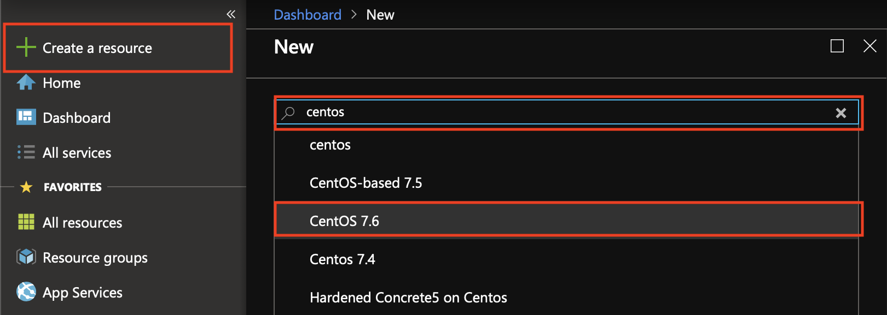

1. You should be presented with a panel describing the service you're going to create; click `Create`.
  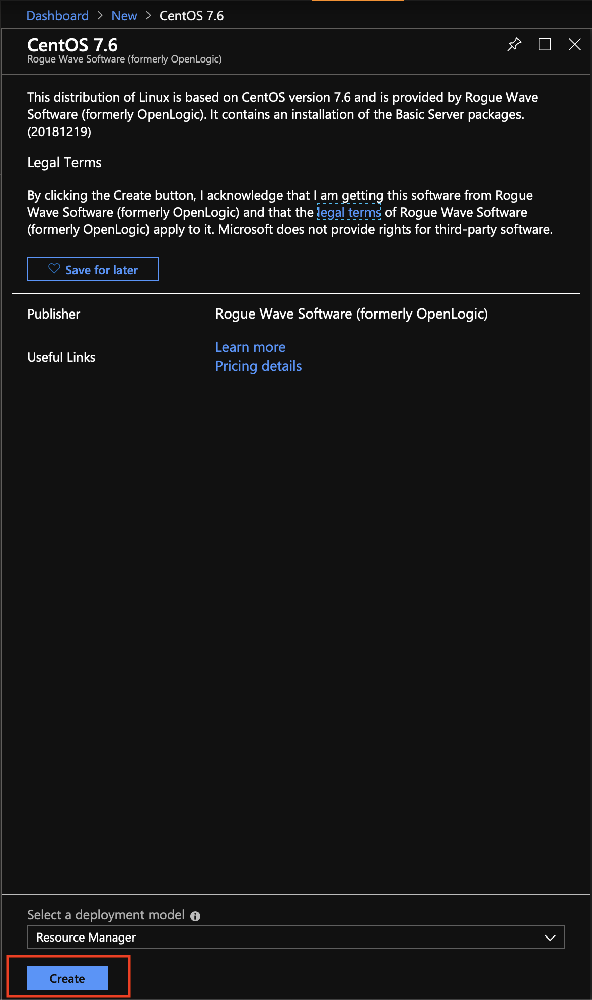

1. Complete the form with information about the VM you want to create, ensuring that you create a new resource group for your VM. Give your VM a name and select a region close to your current location (or another preferred location). Set the authentication type to `password` and provide a valid username-password pair. You will also want to make sure that SSH is selected as a public inbound port. Once you have filled the form in, click `Review + create`.
  

1. You will be asked to review the configuration of your VM; click `Create`.
  

1. Once the VM has completed deploying, click `Go to resource`.
  

1. In order to log into the VM, will need to obtain its IP address. While on the overview section of the VM, click on `Connect`.
  

1. Select `SSH` from the panel that appears, and copy the login information (for later use) which should look something like `ssh mannie@123.45.67.89`.
  


---


## Configuring the VM

1. SSH into your new VM via CLI using the login info provided at creation time:
    ```sh
    ssh __user__@__ip_address_to_azure_vm__ # example mannie@123.45.67.89
    ```
    You will receive a message (similar to this) asking you to confirm that you want to connect to the VM.
    ```
    The authenticity of host '40.84.44.109 (40.84.44.109)' can't be established.
    ECDSA key fingerprint is SHA256:4fYn6C2yelIAsds34GSDGTRgMrhT27Zcdfgytew45F3g.
    Are you sure you want to continue connecting (yes/no)?
    ```
    To confirm that you want to continue accessing the VM, type `yes` and hit `Enter`.

1. x. You will be prompted for your password and for confirmation; enter it and hit `Enter`.
    ```sh
    script=https://raw.githubusercontent.com/mannie/AzureStreamerWorkshop/cli/Portal/ACI/InstallDevTools.sh
    curl --silent --show-error $script | sudo bash
    ```  


---


## Obtaining the Streamer App

1. Git `clone` the [Event Streamer](https://github.com/mannie/EventStreamer) app.
    ```sh
    git clone https://github.com/mannie/EventStreamer.git
    ```
    You should see the output similar to the following...
    ```
    Cloning into 'EventStreamer'...
    remote: Enumerating objects: 158, done.
    remote: Counting objects: 100% (158/158), done.
    remote: Compressing objects: 100% (98/98), done.
    remote: Total 228 (delta 65), reused 130 (delta 46), pack-reused 70
    Receiving objects: 100% (228/228), 151.47 KiB | 0 bytes/s, done.
    Resolving deltas: 100% (92/92), done.
    ```
    ...and find that a new directory is available: `EventStreamer`. Change directory into the project's root, and list the contents.
    ```
    cd EventStreamer && ls -F
    ```
    You don't need to know what to do with this folder structure yet: just note that the `Dockerfile` file exists as we will update this later.
    ```
    Container.gif  Dockerfile  Package.swift  PrepareXCodeProj.sh*  README.md  Sources/  Tests/  Xcode.gif
    ```

1. Build the app and run it locally.
    ```sh
    app=__app_name_or_tag__ # example: app=streamer
    sudo docker build --tag $app .
    sudo docker run --interactive --tty --rm $app
    ```
    Once the app finishes building and starts running, the following output should be somewhat familiar:
    ```
    ...
    STREAM INFO
    	endpoint	 n/a
    	name		 deposit

    STREAM INFO
    	endpoint	 n/a
    	name		 withdrawal

    STREAM INFO
    	endpoint	 n/a
    	name		 purchase

    2019-05-03 19:28:43		depo...	1000 		["initial": 1000, "current": 1000, "name": "deposit"]
    2019-05-03 19:28:43		with...	50 		["initial": 50, "current": 50, "name": "withdrawal"]
    2019-05-03 19:28:44		purc...	10 		["name": "purchase", "current": 10, "initial": 10]
    2019-05-03 19:28:47		purc...	10 		["previous": 10, "initial": 10, "name": "purchase", "current": 10]
    2019-05-03 19:28:47		with...	52 		["previous": 50, "current": 52, "name": "withdrawal", "initial": 50]
    2019-05-03 19:28:48		purc...	12 		["previous": 10, "initial": 10, "name": "purchase", "current": 12]
    ...
    ```
    To stop the streamer, hit  `Ctrl + C`.


---


## Deploying the Streamer App

1. Using the [Azure Portal](https://portal.azure.com), create a new Container Registry into which we will host our app.
  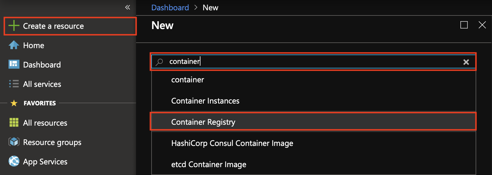

1. Click `Create`, located at the bottom of the service summary page.
  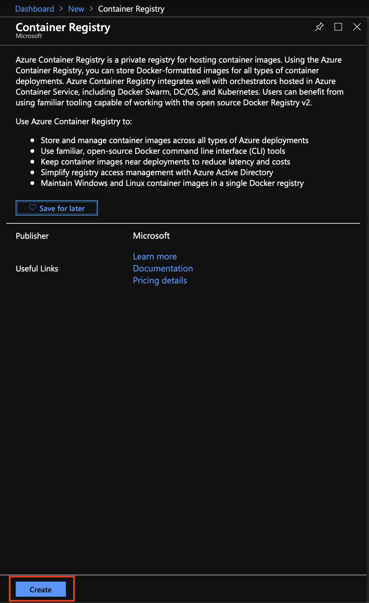

1. Provide a unique name for you registry. Select the project resource group and select the preferred location. Be sure to set the admin user to `Enabled`.
  

1. Once the service has successfully deployed, navigate to the `Access keys` section of the service. You will want to take note of the following properties for future use: `Registry name`, `Login server`, `Username`, and either `password` or `password2`.
  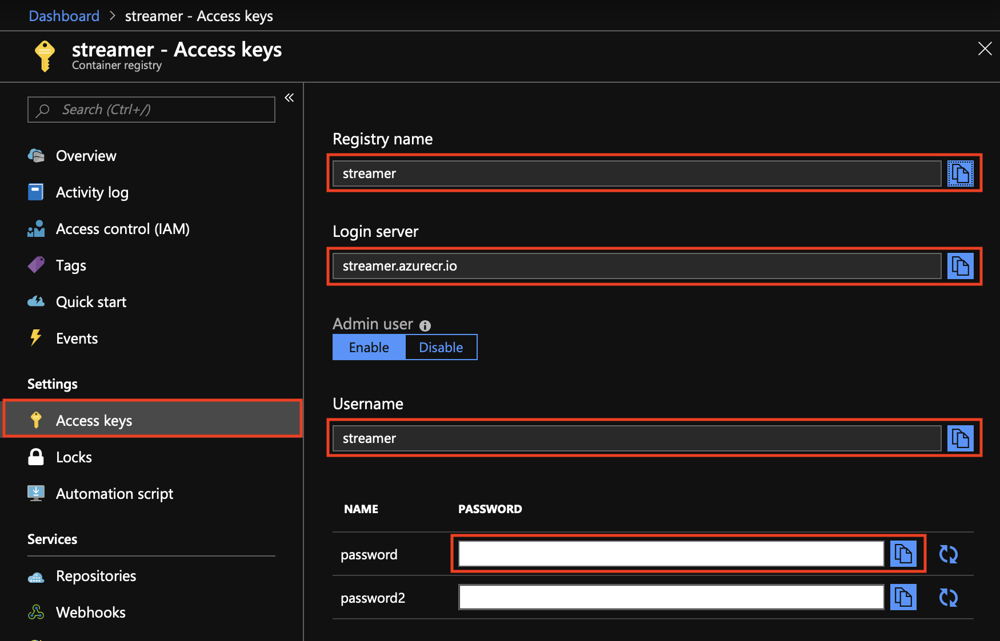

1. In our CLI, we want to run the following commands in order to push the container image into our registry. Be sure to replace `registry=address.to.registry` with the appropriate value (e.g. `registry=streamer.azurecr.io`).
    ```sh
    registry=__address_to_registry__ # example: registry=streamer.azurecr.io

    sudo docker login $registry # enter the Username and Password values from the previous step when/if prompted.
    sudo docker tag streamer $registry/streamer
    sudo docker push $registry/streamer
    ```
    The `docker login` command might yield similar results to...
    ```
    [sudo] password for mannie:
    Username: streamer
    Password:
    WARNING! Your password will be stored unencrypted in /root/.docker/config.json.
    Configure a credential helper to remove this warning. See
    https://docs.docker.com/engine/reference/commandline/login/#credentials-store

    Login Succeeded
    ```
    ...while the `docker push` command something like:
    ```
    The push refers to repository [streamer.azurecr.io/streamer]
    91c5a5eb2384: Pushed
    5a568a65644d: Pushed
    bad91c8e04cc: Pushing [=============>                                     ]  197.1MB/718.1MB
    b637f65d47e5: Pushing [=========>                                         ]  116.9MB/640.8MB
    68dda0c9a8cd: Pushed
    f67191ae09b8: Pushed
    b2fd8b4c3da7: Pushed
    0de2edf7bff4: Pushing [=============================>                     ]   68.8MB/117.2MB
    ```

1. In the [Azure Portal](https://portal.azure.com), we're able to examine the container we have just pushed.
  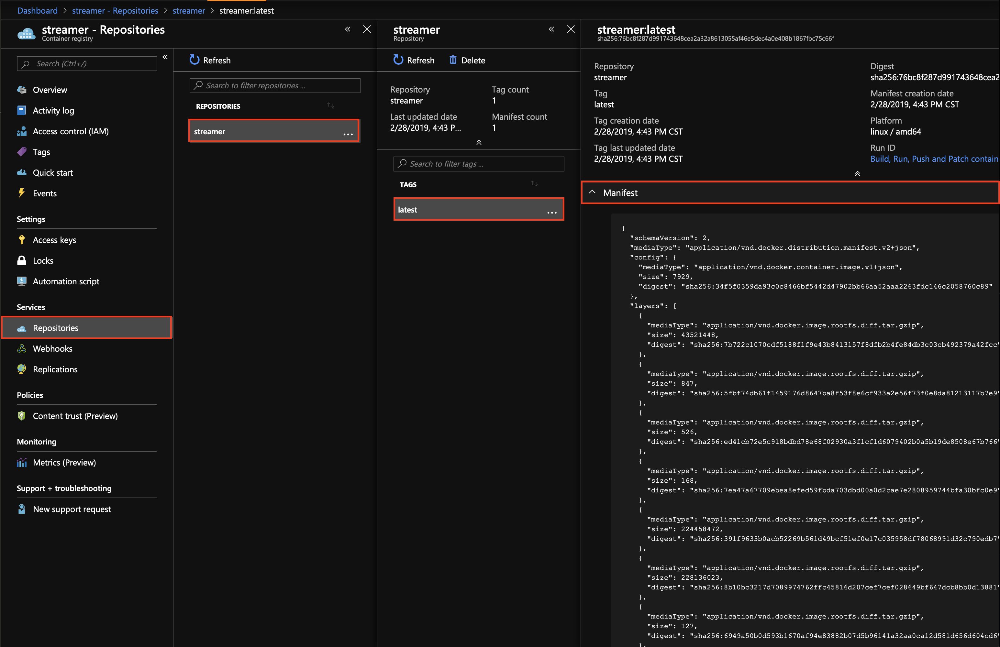

1. Our next step involves the creation of a service that will allow our container to execute in the cloud: Container Instances. Click on `Create a resource` and find `Container Instances`.
  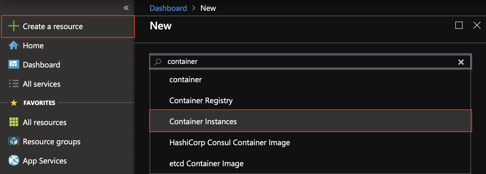

1. Click on the `Create` button at the bottom of the service summary.
  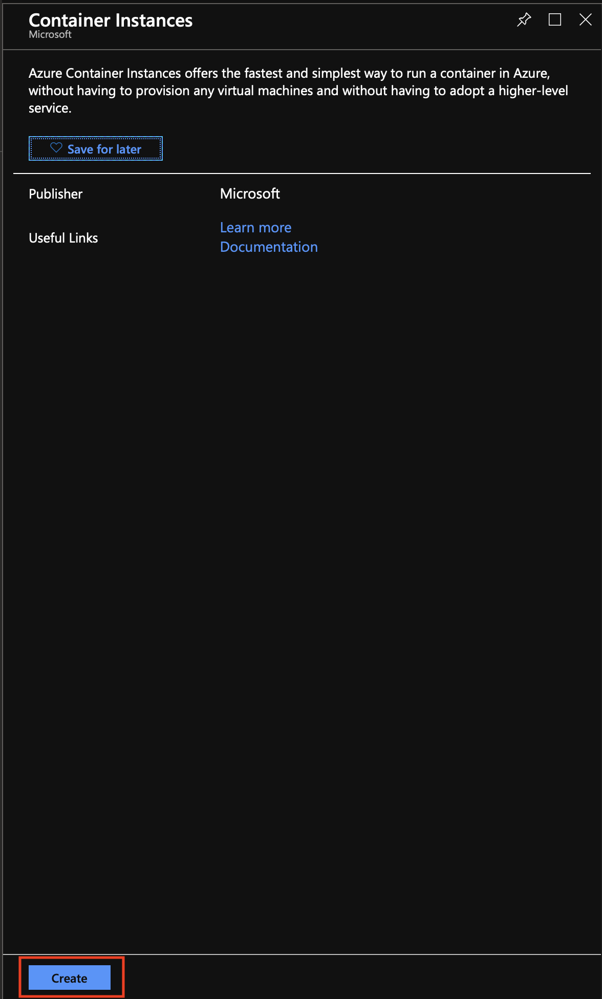

1. Give your resource a name and add it to our project resource group. Ensure that the container image type is set to `Private` and that you provide the details to your registry. Click `OK` on form completion.
  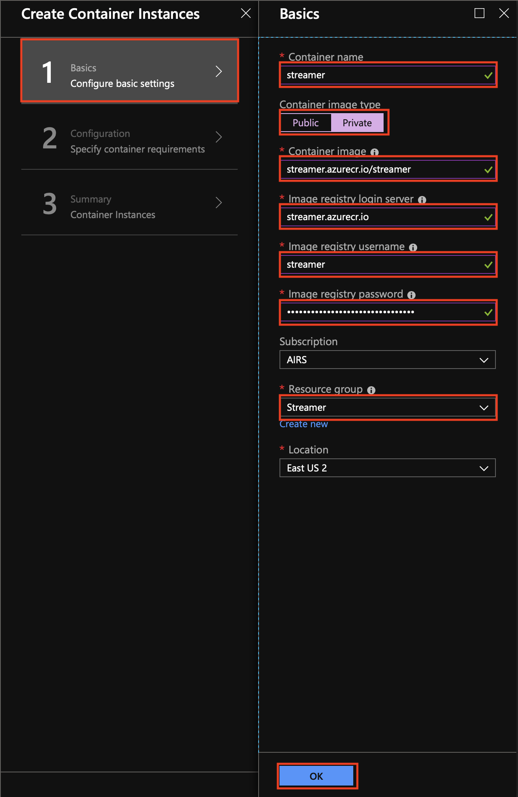

1. Ensure that the OS Type is set to `Linux` and that public IP address is set to `No`. Click `OK` on form completion.
  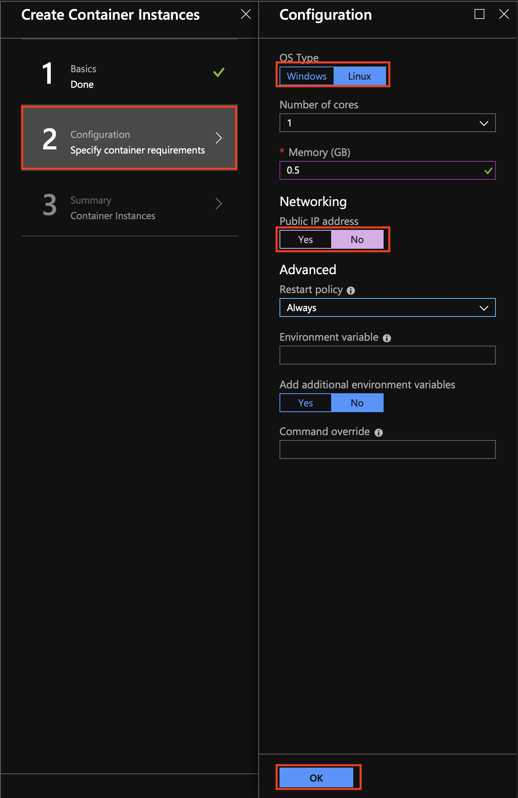

1. If everything checks out, you should be able to hit `OK` and watch your service get deployed.
  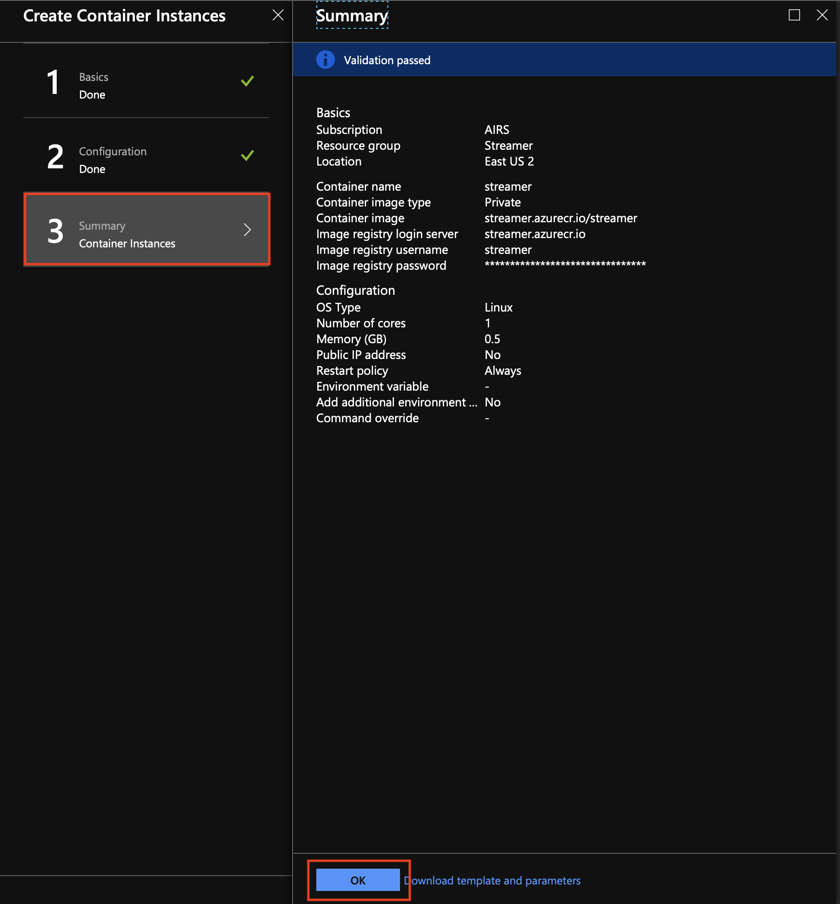

1. Once the ACI has deployed successfully, it will automatically start executing. Head on over the to the `Containers` section of our newly deployed ACI and click on `Logs`. This output should look familiar, and should serve and confirmation of our streamer app running successfully in Azure.
  


---


Move on to [Ingesting events into Event Hubs](EventHubs.md).
