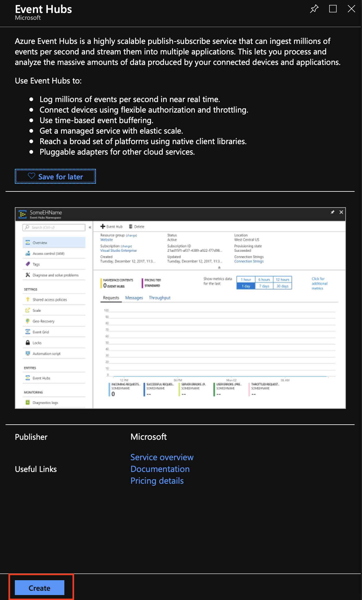
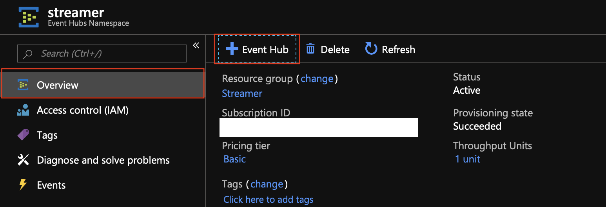
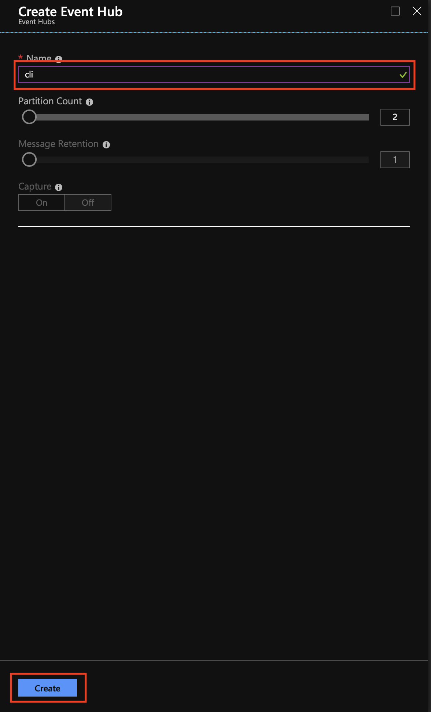
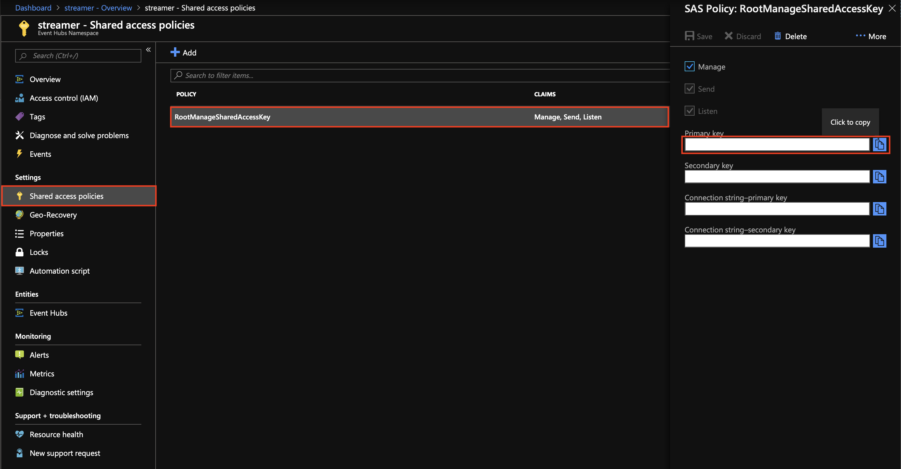
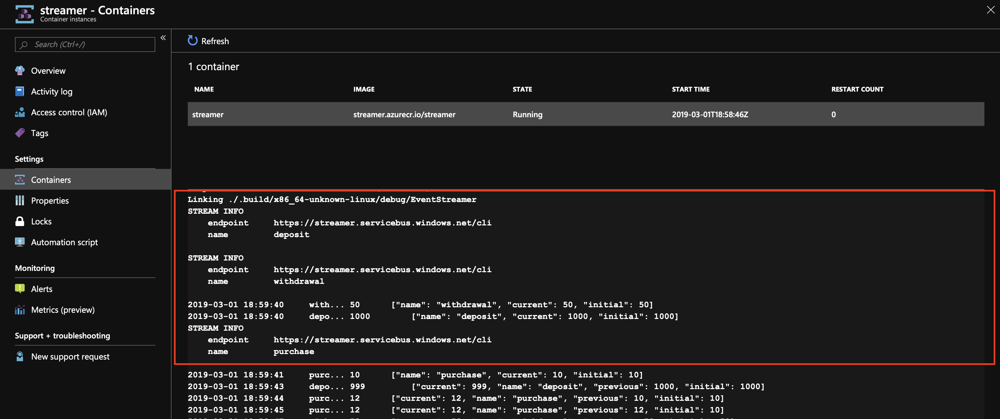

# Ingesting Events Into Event Hubs
Return to [Deploying the streaming app into Azure](ACI.md).


---


In this section, we will create and configure our Event Hub to ingest data from our streamer app and publish it to subscribers. Configuring subscribers is the topic of the next section: [Capturing events in Cosmos DB](LogicApps.md).

**Section Outline**
1. [Creating an Event Hub](#creating-an-event-hub)
1. [Updating the Streamer App](#updating-the-streamer-app)


---


## Creating an Event Hub

1. Click on `Create a resource` and search for `Event Hubs`.
  

1. On the service overview page, click `Create` located at the bottom.
  

1. Fill in the creation form by providing a globally unique namespace for your Event Hub. Select the resource group for the workshop and your preferred location, and click `Create`.
  

1. Upon successful deployment of the service, find your way to the `Overview` section. Click on `+ Event Hub`; we're now going to create the endpoint where our streamer app will stream events to.
  

1. Give your hub a name and click `Create`.
  

1. You should see you newly created hub in the bottom section of the namespace `Overview`.
  


---


## Updating the Streamer App

1. Navigate to the `Shared access policies` section of the Event Hubs Namespace resource. Clicking on the only existing policy (`RootManageSharedAccessKey`) will open a panel on the right; copy (or take note) of either the `Primary key` or the `Secondary key`.
    

1. In our CLI, which should currently be in the `~/EventStreamer` folder, we're going to open the `Dockerfile` file for editing. If you're not in this folder for some reason, `cd` into it.
    ```sh
    nano Dockerfile
    ```

1. Update your `Dockerfile` with the info for your Event Hub. `SASPolicyName` is the name of the SAS Policy whose value we copied (`RootManageSharedAccessKey`), while `SASPolicyKey` is the value we copied. `EventHubNamespace` and `EventHubPath` are the globally unique name of the Event Hub Namespace and that of the Event Hub, respectively. Your `Dockerfile` should look something like this; only the lines beginning with `ENV` should have changed.
    ```
    FROM swift
    ENV SASPolicyName="RootManageSharedAccessKey"
    ENV SASPolicyKey="9gk50LPNstmrs1DKIVdASdkKgxZZSIp4olPRnXZmhDQ="
    ENV EventHubNamespace="streamer"
    ENV EventHubPath="cli"
    WORKDIR /temp
    COPY . ./
    CMD swift package clean
    CMD swift run
    ```

1. Press `Ctrl + X` to exit out of the text editor. This will prompt you to save your changes; type `Y`. You will now be prompted to type in the file name to save to; leave this value unchanged (i.e. `Dockerfile`) and hit `Enter`. To confirm our changes were successfully saved, use the `cat` command.
    ```sh
    cat Dockerfile
    ```

1. Rebuild the streamer app and run it.
    ```sh
    sudo docker build --tag streamer .
    sudo docker run --interactive --tty --rm streamer
    ```
    Once the app starts running, you should see something like this before your events start streaming:
    ```
    STREAM INFO
      endpoint	https://streamer.servicebus.windows.net/cli
      name		deposit
    ```
    If the value of the endpoint is still `n/a`, ensure that the `ENV` variables in your `Dockerfile` are set correctly.

1. Push your updated image up to the container registry. `$registry` should already contain the address to your registy; if not, feel free to update it accordingly.
    ```sh
    registry=address.to.registry # example streamer.azurecr.io
    sudo docker tag streamer $registry/streamer
    sudo docker push $registry/streamer
    ```
    Your output should be similar to this:
    ```
    The push refers to repository [streamer.azurecr.io/streamer]
    30511c2fe5b5: Pushed
    b8f9595eaec3: Pushed
    bad91c8e04cc: Layer already exists
    b637f65d47e5: Layer already exists
    68dda0c9a8cd: Layer already exists
    f67191ae09b8: Layer already exists
    b2fd8b4c3da7: Layer already exists
    0de2edf7bff4: Layer already exists
    latest: digest: sha256:b3c51a74aaecfdec905822e567bab707f1d6873e940af9cd85e8342fe386867a size: 1993
    ```

1. You will need to restart your container group via the portal in order to start executing the updated image. To confirm that all the changes are being picked up, head on over into the `Logs` section of your Container Instance. You should see your update stream info therein.
  

1. Your Event Hub should also be receiving these events. Confirm by heading over to the Event Hub resource within the Event Hub Namespace; the `Overview` section contains some charts showing the number of requests coming in.
  

---


Move on to [Capturing events in Cosmos DB](LogicApps.md).
