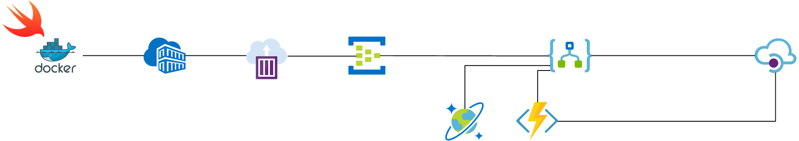

# Azure Streamer Workshop

Serverless is reshaping the way developers think about software/system architectures. By simplifying infrastructure, technologies such as Functions, Logic Apps, and Event Hubs have made is easier to develop reusable APIs (consumed by mobile, desktop, web, and IoT clients).

The burden of managing infrastructure no longer lies with the developer, leaving them to focus on solving the problem (i.e. writing code) instead of worrying about managing the environment. Infrastructure professionals also benefit from PaaS; thanks to auto-scale and micro-billing, there are financial savings to be realized without sacrificing scalability per demand.

In this workshop, you will develop an end-to-end data streaming/processing solution using a variety of technologies. We will walk through how to deploy an event generation/streaming application into [Azure Container Instances](https://azure.microsoft.com/en-us/services/container-instances/); this app will be the data source of our pipeline. Events will be streamed to [Event Hubs](https://azure.microsoft.com/en-us/services/event-hubs/), after which [Logic Apps](https://azure.microsoft.com/en-us/services/logic-apps/) will respond to each event entering the pipeline, using [Functions](https://azure.microsoft.com/en-us/services/functions/) for data enrichment prior to storing the events in [Cosmos DB](https://azure.microsoft.com/en-us/services/cosmos-db/) for future consumption. [API Management](https://azure.microsoft.com/en-us/services/api-management/) will provide an abstraction layer over our newly created APIs, to support reuse of code by others.

### Target Audience
* Technical roles (engineers, architects, infrastructure managers, etc.).
* Anyone interested in automating business processes.
* Anyone interested in learning about Azure and Serverless.

### Requirements
* An active [Azure Subscription](https://azure.microsoft.com/en-us/free/).
* An internet enabled computer.

## Getting Started
1. [Deploying the streaming app into Azure](ACI.md).
1. [Ingesting events into Event Hubs](EventHubs.md).
1. [Capturing events in Cosmos DB](LogicApps.md).
1. [Enriching the event's payload](Functions.md).
1. [Sharing our APIs with others](APIM.md).
1. [Review and next steps](Review.md).

**Note**: it may be worth preloading your API Management service as this service typically take a little while to set up; for more info on how to create your API Management service, see [Creating the API Management Service](APIM.md#creating-the-api-management-service).

